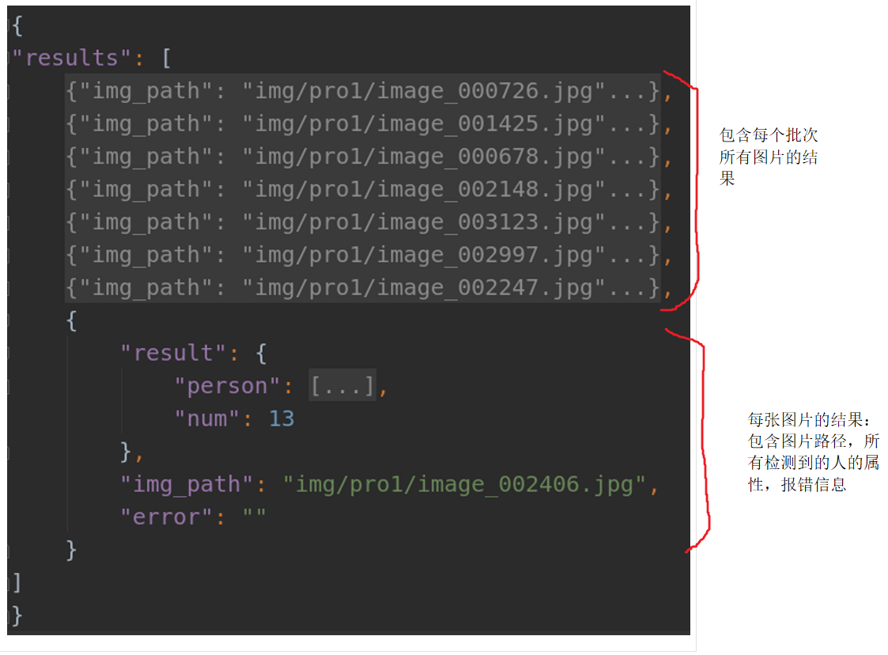

# 学生行为分析脚本 connector_mp.py
## 脚本参数说明
整个接口包含model_process，socket_process两个大类，  
分别用于模型推理和请求接收以及结果发送，参数如下  

**日志相关参数**  
log_rotator：日志文件循环的间隔，默认值为"D"，即按天更换文件; 其他可用的值包括："S"（秒）, "M"（分钟）, "H"（小时）, "W0"-"W6"（每周，"W0"为周一）  
log_keep：历史日志的保存长度，默认值为7，需要与log_rotator配合使用。例如log_rotator为"D"并且log_keep为7时，过去一周的日志将会被保留，更早的日志将被删除。  

**model_process参数**  
```python
def __init__(self,
                 weights=None,#需要加载的模型文件[yolov5参数，姿态估计模型参数]
                 configs=None,#姿态估计模型的配置文件，不用调整[yolov5配置文件，姿态估计模型配置文件]
                 device=0,#指定具体哪块GPU，比如0，1，2。-1时使用cpu
                 flip_test=False,#是否翻转图像进行二次估计姿态，不用调整
                 logger_name="connector",#日志名称，不用调整
                 max_bz=1,#yolov5检测模型最大批处理大小
                 max_bz_pose=5,#姿态估计模型最大批处理大小
                 save_dir="",#结果保存路径，供测试使用，不用调整
                 result_queue=None,#不同模型进程用于保存结果的队列
                 request_queue=None,#不同模型进程用于读取请求的队列
                 locker_request=None,#请求队列的锁
                 locker_result=None,#结果队列的锁
                 detector=None,#
                 index=None,#当前模型进程的索引
                 memory_config=None,#保存模型在不同批处理大小下占用显存的大小
                 gap=100#指定模型间隔多少个批此后调整批处理大小
                 ):
```

**socket_process参数**  
```python
def __init__(self,
                 port=8080,#socket端口
                 logger_name="",#日志名称
                 result_queue=None,#保存模型处理结果的队列
                 request_queue=None,#保存请求的队列
                 locker_request=None,#请求队列的锁
                 locker_result=None,#结果队列的锁
                 ):
```
---

## 脚本调用说明：

### 脚本调用方法：
```python
    python connector_mp.py\
        --max_bz xxx\
        --max_bz_pose xxx\
        --max_num_processes xxx\
        --logger_name_model xxx\
        --logger_name_socket xxx\
        --device xxx\
        --flip_test xxx\
        --ip_port xxx\
        --mem_config xxx\
        --gap xxx\
        --process_imgs_thres xxx\
        --window_size xxx\
        --track xxx\
        --visualization xxx
```

## 脚本的参数解析

```python
    #检测模型最大批处理大小
    parser.add_argument("--max_bz",type=int,default=8,help="batch_size of yolov5_model")
    #姿态估计模型最大批处理大小
    parser.add_argument("--max_bz_pose",type=int,default=5,help="batch_size of pose_model")
    #模型进程数量
    parser.add_argument("--max_num_processes",type=int,default=1)
    #模型进程日志文件名称，不用调整
    parser.add_argument("--logger_name_model",type=str,default="model")
    #socket进程日志名称，不用调整
    parser.add_argument("--logger_name_socket", type=str, default="socket")
    #使用GPU的ID
    parser.add_argument("--device",type=int,default=0)
    #姿态模型使用二次翻转测试，不用调整
    parser.add_argument("--flip_test",action="store_true")
    #socket使用的端口
    parser.add_argument("--ip_port",type=int,default=8036)
    #不同批处理大小下模型使用的显存大小，不用调整
    parser.add_argument("--mem_config", type=str, default="mem_config.yml")
    #模型进程调整批处理大小的间隔，不用调整
    parser.add_argument("--gap", type=int, default=50)
    #跟踪模式下跟踪视频的长度
    parser.add_argument("--process_imgs_thres",type=int,default=21)
    #跟踪模式下聚合行为得分的时间维度窗口大小，越大越准确，但是召回越低，同时不能太大
    parser.add_argument("--window_size", type=int, default=7, help="the size of the window to aggregate scores")
    #是否使用跟踪模式
    parser.add_argument("--track",action="store_true",help="using tracking module")
    #是否保存可视化的结果
    parser.add_argument("--visualization",action="store_true",help="whether to visualize the results")
```

## 输出json文件格式
### 整个批次结果的格式


### 单张图片结果的格式


## 硬件使用说明
1. 使用ONNX模型(加载.onnx模型)
   1. 使用CPU：CUDA版本为11.0以下，无论安装onnxruntime还是onnxruntime-gpu，都将使用CPU推理
   2. 使用GPU: CUDA版本11.0以上，仅安装onnxruntime-gpu，会自动调用GPU推理
2. 使用Pytorch模型(加载.pt模型)
   1. 使用CPU：Detect实例化的时候，device指定小于0的整数，比如-1，-2...
   2. 使用GPU: Detect实例化的时候，指定device参数为GPU的id，比如0，1，2...

## 估计资源消耗
BZ(同时处理图片数量)   GPU    CPU  memory    time_allimage      time_perimage
10                  4.9G    5%   2.7G         4.52s                  0.452s  


## 依赖的软件包  
json  
yaml  
torch-1.7.0  
numpy  
opencv-python  
onnxruntime(如果使用onnx进行推理)  
torchvision-0.8.0  
thop  
uuid  
PIL  
tqdm  
pandas  
matplotlib  

## SVN存在版本的说明  
### v0.1.0:      
1.模块化YoloV5代码；
2.分块推理策略以及结果融合策略；
3.姿态估计模型与手机二次判断策略；

### v0.1.1:    
1.检测和姿态模型的批处理接口；
2.轻量化姿态估计模型；
3.模型的并发运行接口；
4.模型的服务接口；
5.根据显存容量的动态批处理大小策略。

### v0.1.2:  
1.添加规则，利用学生的预测框面积大小的排名对靠后学生的行为分数使用基于排名的自动衰减系数，降低后排学生的行为预测分数；
2.添加规则，计算每个学生与其余所有学生目标框的重叠大小，将超过阈值的学生的行为分数乘以一个基于重叠率衰减的系数，降低重叠严重的学生的行为分数。